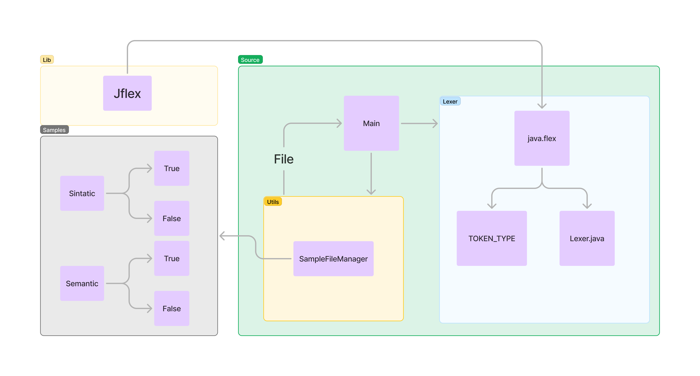

<h1 align="center">
    <b> Lang Compiler </b> 
</h1>

<p align="center">
  
  
</p>

Este trabalho foi desenvolvido como parte da disciplina DCC045 - Teoria dos compiladores - UFJF, ministrada pelo professor Leonardo Vieira dos Santos Reis.

## Objetivo

Este trabalho descreve a implementação de um analisador léxico Java para a linguagem de programação fictícia chamada de "lang" utilizando Jflex. Neste projeto será possível captura e printar em tela todos os tokens obtidos, além de processar seus tipos e valores.


## Integrantes

- Nome: Charles Lelis Braga -- Matrícula: 202035015
- Nome: Gabriella Carvalho -- Matrícula: 202165047AC

## Informações

- Java version: Foi testado na 21.0.2 e na 17

# Analisador Léxico

## Como rodar o projeto

### Java

É necessário ter o Java instalado na máquina.

O projeto foi desenvolvido com Java 21.0.2 e testado tanto nessa versão quanto na 17. Não é utilizado nenhuma funcionalidade específica de uma versão, portanto é provável que seja possível rodar em qualquer versão recente.

### Linux

```bash
./build.sh
```

### Windows

```markdown

java -jar ./lib/jflex-full-1.8.2.jar ./src/core/Lexer/lang.flex
javac -d bin src/core/Lexer/Lexer.java src/core/Lexer/Token.java src/core/Lexer/TOKEN_TYPE.java src/core/Lexer/LexerProcessor.java  ./src/utils/SampleFileManager/SampleFileManager.java src/App.java ; java -cp bin App
```

# Estratégias de implementação

### Arquitetura do projeto

O projeto do analisador léxico é estruturado em três diretórios: Source, Lib e Samples.

A Lib armazena todos os pacotes necessários, nesse caso, apenas o JFlex, que é usado para gerar o analisador léxico (`Lexer.java`) a partir da especificação contida no arquivo `java.flex`.

A pasta Source contém os arquivos e o código-fonte do projeto, onde a Main é o ponto de entrada, coordenando as chamadas para o Lexer e outros componentes. O subcomponente Lexer contém o arquivo `java.flex`, que é um arquivo de definição para o JFlex. A partir deste arquivo, são gerados dois elementos principais: o `TOKEN_TYPE`, que define os tipos de tokens que o lexer irá identificar, e o `Lexer.java`, que é o código-fonte do lexer gerado automaticamente e responsável por reconhecer e categorizar os tokens do código de entrada.

O Utils inclui o `SampleFileManager`, que é um gerenciador de arquivos responsável por lidar com as operações de leitura e escrita necessárias para o processamento dos arquivos de entrada e saída no projeto.

Já o diretório Samples armazena exemplos utilizados para validação sintática e semântica. Dentro deste componente, o submódulo Sintatic contém amostras para validação sintática, com resultados esperados categorizados como `True` ou `False`, dependendo se o exemplo atende ou não às regras sintáticas definidas. Da mesma forma, o submódulo Semantic armazena amostras para validação semântica, também com resultados `True` ou `False`, verificando se as amostras são semanticamente corretas de acordo com as regras especificadas. Obviamente, nesse ponto do trabalho, só valida-se a captura de tokens.



Desta forma, segue os diretórios ficaram da seguinte forma:

```prolog
samples/
├── semantic/
│   ├── true/
│   └── false/
└── sintatic/
    ├── true/
    └── false/
lib/
└── jflex-full-1.8.2.jar
src/
├── core/
│   └── Lexer/
│       ├── lang.flex
│       ├── Lexer.Java
│       ├── LexerProcessor.java
│       ├── TOKEN_TYPE.java
│       └── Token.java
├── utils/
│   └── SampleFileManager
└── App.java
build.sh
```

## Inicialização do processamento

A função `main` da classe `App` é o ponto de entrada do programa. Ela utiliza o método `getSampleFile` da classe `SampleFileManager` para obter um arquivo de entrada, que pode ser escolhido pelo usuário ou pré-definido. Esse arquivo é então passado para o método `process` da classe `Lexer`, que realiza a análise léxica, identificando e categorizando os tokens do conteúdo do arquivo.

### Tokens

O uso de tokens no analisador léxico é uma etapa fundamental no processo de compilação e interpretação de linguagens de programação. 

No código, o Token é deifinido pela classe `Token` , que possui um tipo (`t`) e o objeto (`Object info`). A classificação de tipos possuem três categorias que facilitam o entendimento deles: 

Os tokens de palavras reservadas (`reservedWordsTypes`) incluem elementos como `if`, `else`, `while` e outras palavras-chave que controlam o fluxo do programa. Esses tokens são retornados diretamente como strings representando suas palavras originais.

Os tipos de valores (`valuablesTypes`) abrangem tokens que representam dados, como `int`, `float`, `char`, e identificadores (`ID`). Para esses tokens, o método retorna o tipo do token junto com a informação adicional associada (`info`), que pode incluir o valor ou nome específico do token.

Por fim, os operadores (`operatorsTypes`) incluem símbolos como `+`, `-`, `*`, `==`, `&&`, `||`, parênteses e outros operadores da linguagem. Para esses tokens, o método retorna apenas a `info`, que descreve o operador específico encontrado no código. Essa estrutura facilita a compreensão de como cada token é utilizado na análise léxica, categorizando-os com base no papel que desempenham no código.

## Lexer

O analisador é configurado com várias opções do JFlex que controlam seu comportamento:

- `%unicode`: Garante o suporte a caracteres Unicode.
- `%line` e `%column`: Incluem informações de linha e coluna para melhor rastreamento de erros.
- `%public`: Define a classe gerada como pública.
- `%class LexerProcessor`: Nomeia a classe do analisador léxico.
- `%function nextToken`: Define a função que retorna o próximo token.
- `%type Token`: Define o tipo dos tokens gerados.

## Inicialização e Utilitários

O bloco de inicialização e os métodos utilitários fornecem suporte para a contagem de tokens e a criação de instâncias de tokens:

- **Variável `ntk`**: Conta o número de tokens processados.
- **Método `readedTokens`**: Retorna a quantidade total de tokens lidos.
- **Método `symbol`**: Cria um token com um tipo específico e um valor associado. Existem duas sobrecargas deste método, uma para tokens simples e outra para tokens com valores adicionais.

```java
%{
  private int ntk;

  public int readedTokens(){
    return ntk;
  }

  private Token symbol(TOKEN_TYPE t) {
    ntk++;
    return new Token(t, yytext());
  }

  private Token symbol(TOKEN_TYPE t, Object value) {
    ntk++;
    return new Token(t, value);
  }
%}

%init{
  ntk = 0;
%init}
```

## Definições de Tokens

As definições de tokens são fundamentais para reconhecer e classificar diferentes elementos no código-fonte:

- **Alfabeto e Identificadores**:
    - `ALPHA`, `ALPHA_UPPERCASE`, `ALPHA_LOWERCASE` definem conjuntos de caracteres alfabéticos.
    - `IDENT_UPPERCASE` e `IDENT_LOWERCASE` definem padrões para identificadores, considerando letras, dígitos e sublinhados.
- **Números e Tipos de Dados**:
    - `INT` e `FLOAT` definem padrões para números inteiros e de ponto flutuante.
- **Caracteres Especiais**:
    - Definem os caracteres que são utilizados para formatação e controle, como novas linhas, espaços em branco e caracteres de escape.

```java
ALPHA = [A-Za-z]
ALPHA_UPPERCASE=[A-Z]
ALPHA_LOWERCASE=[a-z]

INT= [:digit:] [:digit:]*  
FLOAT= [-+]?([:digit:]+ \. [:digit:]*)
IDENT_UPPERCASE = {ALPHA_UPPERCASE}({ALPHA}|:digit:|_)*
IDENT_LOWERCASE = {ALPHA_LOWERCASE}({ALPHA}|:digit:|_)*

NEW_LINE=\r|\n|\r\n
WHITE_SPACE_CHAR=[\n\r\ \t\b]

CHAR_NEWLINE = \\n
CHAR_TAB = \\t
CHAR_BACKSPACE = \\b
CHAR_CARRIAGE = \\r
CHAR_BACKSLASH = \\\\
CHAR_QUOTE = \\\'

```

## Regras de Token

As regras de token são agrupadas em diferentes estados, cada um lidando com aspectos específicos da linguagem:

### Estado Inicial (`YYINITIAL`)

O estado inicial é responsável por reconhecer e classificar palavras reservadas, identificadores, tipos de dados e operadores. Ele também lida com comentários e caracteres especiais, como parênteses e operadores.

```java
<YYINITIAL>{
  /* RESERVED_WORDS */
    "if" { return symbol(TOKEN_TYPE.IF); }
    "else" { return symbol(TOKEN_TYPE.ELSE); }
    "while" { return symbol(TOKEN_TYPE.WHILE); }
    "for" { return symbol(TOKEN_TYPE.FOR); }
    "return" { return symbol(TOKEN_TYPE.RETURN); }
    "break" { return symbol(TOKEN_TYPE.BREAK); }
    "continue" { return symbol(TOKEN_TYPE.CONTINUE); }
    "new" { return symbol(TOKEN_TYPE.NEW); }
    "void" { return symbol(TOKEN_TYPE.VOID); }
    "struct" { return symbol(TOKEN_TYPE.STRUCT); }
    "typedef" { return symbol(TOKEN_TYPE.TYPEDEF); }
    "switch" { return symbol(TOKEN_TYPE.SWITCH); }
    "case" { return symbol(TOKEN_TYPE.CASE); }
    "default" { return symbol(TOKEN_TYPE.DEFAULT); }
    "null" { return symbol(TOKEN_TYPE.NULL); }
    "true" { return symbol(TOKEN_TYPE.BOOL); }
    "false" { return symbol(TOKEN_TYPE.BOOL); }
    "print" { return symbol(TOKEN_TYPE.PRINT); }
    "scan" { return symbol(TOKEN_TYPE.SCAN); }    

    "Int" { return symbol(TOKEN_TYPE.BTYPE); }
    "Float" { return symbol(TOKEN_TYPE.BTYPE); }
    "Char" { return symbol(TOKEN_TYPE.BTYPE); }
    "Bool" { return symbol(TOKEN_TYPE.BTYPE); }

    {IDENT_LOWERCASE} { return symbol(TOKEN_TYPE.ID, yytext()); }
    {IDENT_UPPERCASE} { return symbol(TOKEN_TYPE.TYPE, yytext()); }
    {INT} { return symbol(TOKEN_TYPE.INT, yytext()); }
    {FLOAT} { return symbol(TOKEN_TYPE.FLOAT, yytext()); }

    "--" { yybegin(LINE_COMMENT); }
    "{-" { yybegin(COMMENT); }
    
    "=" { return symbol(TOKEN_TYPE.ASSIGNMENT); }
    "==" { return symbol(TOKEN_TYPE.EQ); }
    "!=" { return symbol(TOKEN_TYPE.NOT_EQ); }
    ";" { return symbol(TOKEN_TYPE.SEMI); }
    "*" { return symbol(TOKEN_TYPE.TIMES); }
    "+" { return symbol(TOKEN_TYPE.PLUS); }
    "%" { return symbol(TOKEN_TYPE.MOD); }
    "," { return symbol(TOKEN_TYPE.COMMA); }
    "::" { return symbol(TOKEN_TYPE.DOUBLE_COLON); }
    ":" { return symbol(TOKEN_TYPE.COLON); }

    "'" { yybegin(CHAR_SINGLE_QUOTE); return symbol(TOKEN_TYPE.SINGLE_QUOTE); }
    
    "(" { return symbol(TOKEN_TYPE.LEFT_PAREN); }
    ")" { return symbol(TOKEN_TYPE.RIGHT_PAREN); }
    "[" { return symbol(TOKEN_TYPE.LEFT_BRACKET); }
    "]" { return symbol(TOKEN_TYPE.RIGHT_BRACKET); }
    "{" { return symbol(TOKEN_TYPE.LEFT_BRACE); }
    "}" { return symbol(TOKEN_TYPE.RIGHT_BRACE); }
    "." { return symbol(TOKEN_TYPE.DOT); }
    "-" { return symbol(TOKEN_TYPE.MINUS); }
    "/" { return symbol(TOKEN_TYPE.DIVIDE); }
    "<>" { return symbol(TOKEN_TYPE.NOT_EQUAL); }
    "<=" { return symbol(TOKEN_TYPE.LESS_THAN_OR_EQUAL); }
    "<" { return symbol(TOKEN_TYPE.LESS_THAN); }
    ">=" { return symbol(TOKEN_TYPE.GREATER_THAN_OR_EQUAL); }
    ">" { return symbol(TOKEN_TYPE.GREATER_THAN); }
    "&&" { return symbol(TOKEN_TYPE.DOUBLE_AMPERSAND); }
    "&" { return symbol(TOKEN_TYPE.AMPERSAND); }
    "!" { return symbol(TOKEN_TYPE.EXCLAMATION_MARK); }
    "||" { return symbol(TOKEN_TYPE.DOUBLE_PIPE); }
    "|" { return symbol(TOKEN_TYPE.PIPE); }

    {WHITE_SPACE_CHAR} { }
}

```

### Estado de Citação de Caractere Único (`CHAR_SINGLE_QUOTE`)

Este estado lida com a leitura de caracteres dentro de aspas simples. Se um caractere de nova linha ou um caractere especial é encontrado, o analisador muda para o estado `END_CHAR_SINGLE_QUOTE`.

```java
<CHAR_SINGLE_QUOTE> {
    {CHAR_NEWLINE} { yybegin(END_CHAR_SINGLE_QUOTE); return symbol(TOKEN_TYPE.CHAR); }
    {CHAR_TAB} { yybegin(END_CHAR_SINGLE_QUOTE); return symbol(TOKEN_TYPE.CHAR); }
    {CHAR_BACKSPACE} { yybegin(END_CHAR_SINGLE_QUOTE); return symbol(TOKEN_TYPE.CHAR); }
    {CHAR_CARRIAGE} { yybegin(END_CHAR_SINGLE_QUOTE); return symbol(TOKEN_TYPE.CHAR); }
    {CHAR_BACKSLASH} { yybegin(END_CHAR_SINGLE_QUOTE); return symbol(TOKEN_TYPE.CHAR); }
    {CHAR_QUOTE} { yybegin(END_CHAR_SINGLE_QUOTE); return symbol(TOKEN_TYPE.CHAR); }
    {ALPHA} { yybegin(END_CHAR_SINGLE_QUOTE); return symbol(TOKEN_TYPE.CHAR); }
}

```

### Estado de Fim de Citação de Caractere Único (`END_CHAR_SINGLE_QUOTE`)

Este estado lida com o fechamento da citação de caractere único e retorna o token apropriado ao mudar de volta para o estado `YYINITIAL`.

```java
<END_CHAR_SINGLE_QUOTE> {
  "\'" { yybegin(YYINITIAL); return symbol(TOKEN_TYPE.SINGLE_QUOTE); }
}

```

### Estado de Comentário Multilinha (`COMMENT`)

O estado de comentário multilinha lida com blocos de comentários que começam com `{-` e terminam com `-}`.

```java
<COMMENT>{
   "-}"     { yybegin(YYINITIAL); } 
   [^"-}"]  {                     }
}

```

### Estado de Comentário de Linha (`LINE_COMMENT`)

O estado de comentário de linha lida com comentários que se estendem até o final da linha.

```
<LINE_COMMENT>{
    {NEW_LINE} { yybegin(YYINITIAL); }
    [^\n\r] { }
}

```

### Tratamento de Erros

Qualquer caractere não reconhecido é tratado como um erro, lançando uma exceção com uma mensagem descritiva.

```java
javaCopy code
[^] { throw new RuntimeException("Illegal character <"+yytext()+">"); }

```